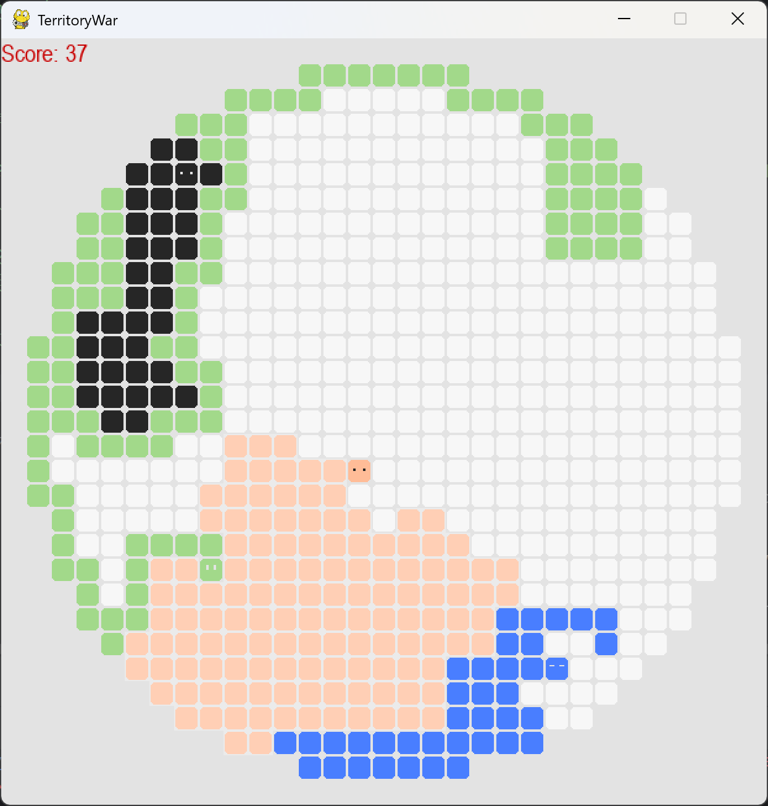
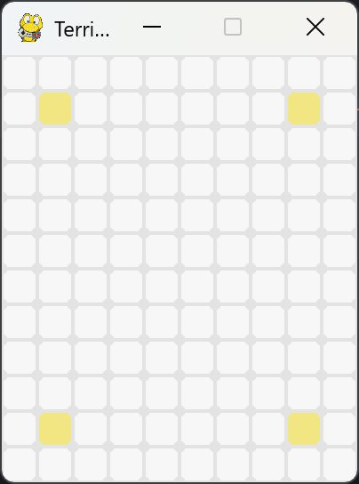
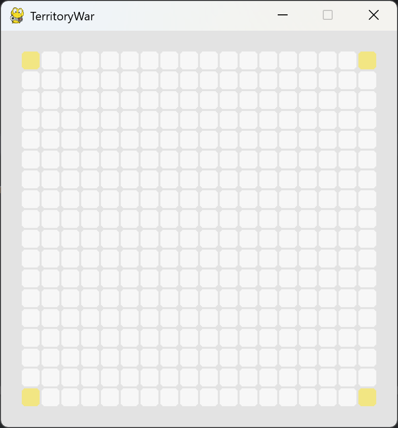
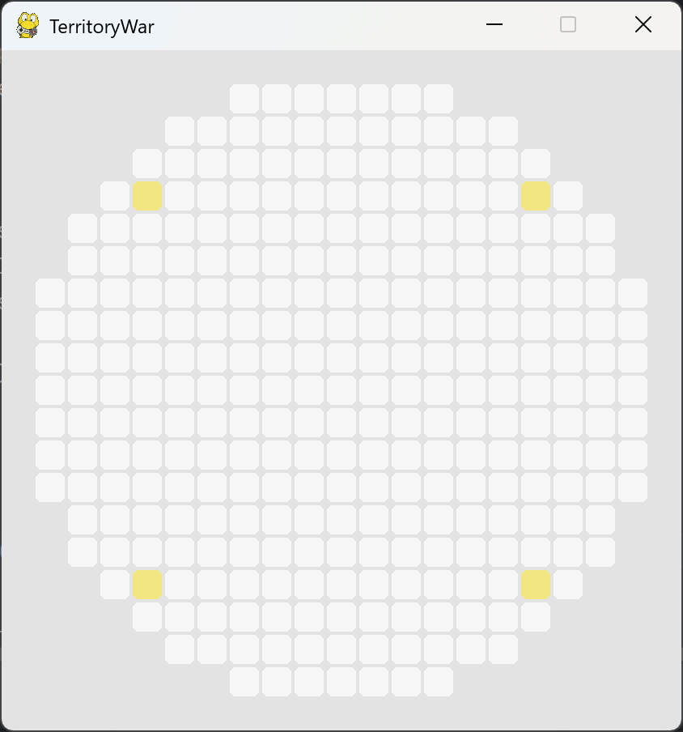

# TERRITORY WAR
A python implementation of territory war for Reinforcement Learning

change the variables in 'variables.py' to try out different tilemaps & bots

## Installations
This project is based on python. Below are the packages that needs to be installed:

pygame
matplotlib
numpy
pytorch

## Run
Run 'agent.py' to train RL agent

Run 'human_playable.py' to play yourself 

Use Arrow keys to move to each direction

For both case, player and agents are 'black' colored, and other colors are bots

## Sample run
- Main  menu       

### maps
- blank (10 x 12)

- box (20 x 20)

- circle (radius 10)

- maze (TBU)

## Files
- tile.py      
Tile class
- bot.py      
Bot class - player, bots, ai all uses this class, which moves 
- agent.py       
trainable Agent class
- model.py      
Agent model NN
- environment.py          
Environment for learning
- human_playable.py      
Interactable game (without AI)
- trajectory_simulation.py
Execute trajectory saved as txt file
- enclosureProblem.py      
Enclosing algorithm
- container.py      
Image, Text class
- gui.py      
GUI (UNUSED)
- plotting.py      
for plotting graph
- tileDataIO.py      
read & write .txt files
- variables.py      
contains global variables

## Version history
2026.05.27 Initial commit               
2026.05.28 Git Reset             
- Added trajectory simulation (Enter to forward, Backspace to reverse - step by step using Right/Left arrow keys)      
- Enclosure bug fixed 

2026.05.29 
- plotting recent 10 scores           
- blank map and circle maps of any size can be generated!
- dataclass for better bot list

- model parameter loading (for inference or continued learning)

### TODO
- human be able to play with learned model (only inference step)

